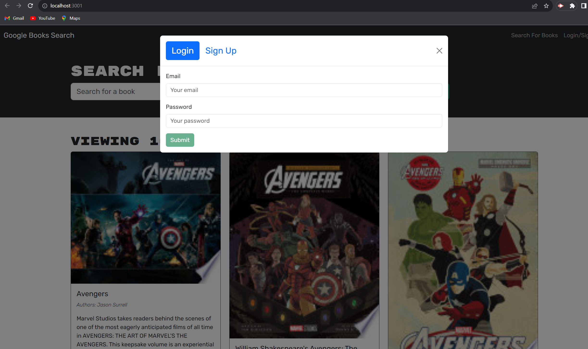
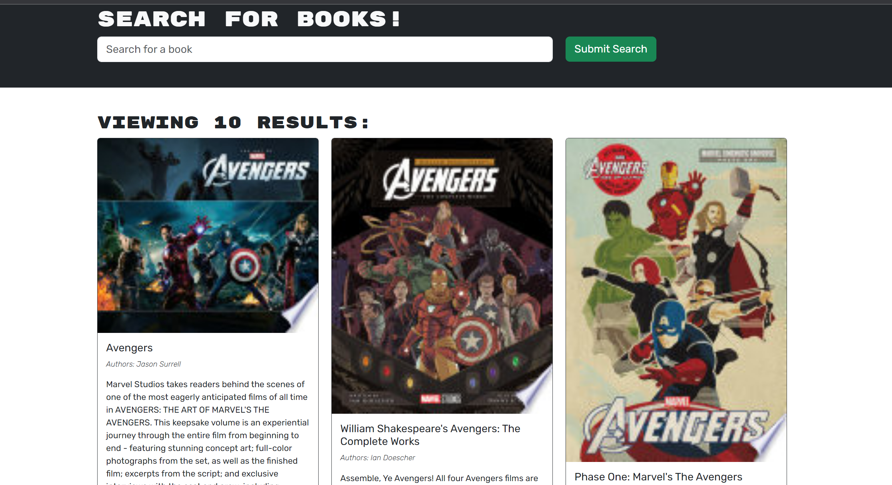

# Book-Search-Engine

## Description
This final challenge is a book search engine using the MERN tool. It lets us search any book and save them to our likings and we can also view the saved books in our profile. We can log in and log out from the homepage and also sign up if we do not have an account. 

## Installation
In the terminal, please run the command:
```
npm i
```
```
npm run develop
```
It should be running in a localhost of 3000. 

## Screenshots

